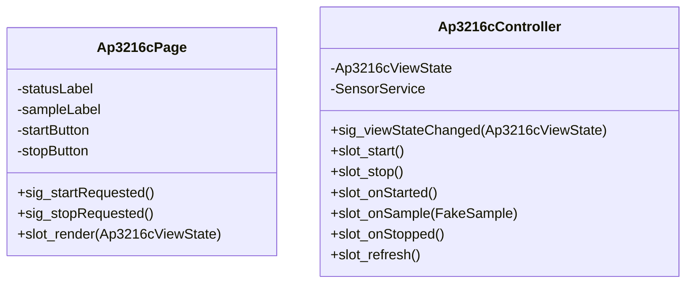

# system class diagram

- page：传递触控操作signal，渲染传参
  - 创建 pushbutton，connect绑定button 按下与 signal
  - 创建 label，connect 绑定 slot render，根据传参刷新label与pushbutton
- service：
- controller
  - 内嵌 service

```mermaid
classDiagram
    class Ap3216cPage{
        -statusLabel
        -sampleLabel
        -startButton
        -stopButton
        +sig_startRequested()
        +sig_stopRequested()
        +slot_render(Ap3216cViewState)
    }
    class Ap3216cController{
        -Ap3216cViewState
        -SensorService
        +sig_viewStateChanged(Ap3216cViewState)
        +slot_start()
        +slot_stop()
        +slot_onStarted()
        +slot_onSample(FakeSample)
        +slot_onStopped()
        +slot_refresh()
    }
```

