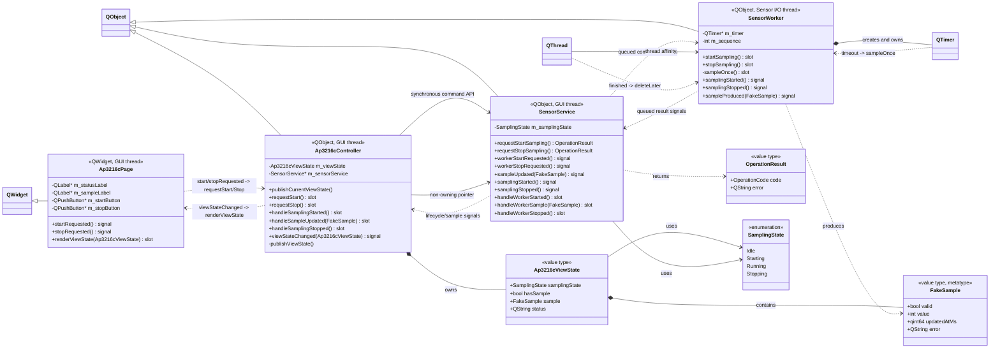
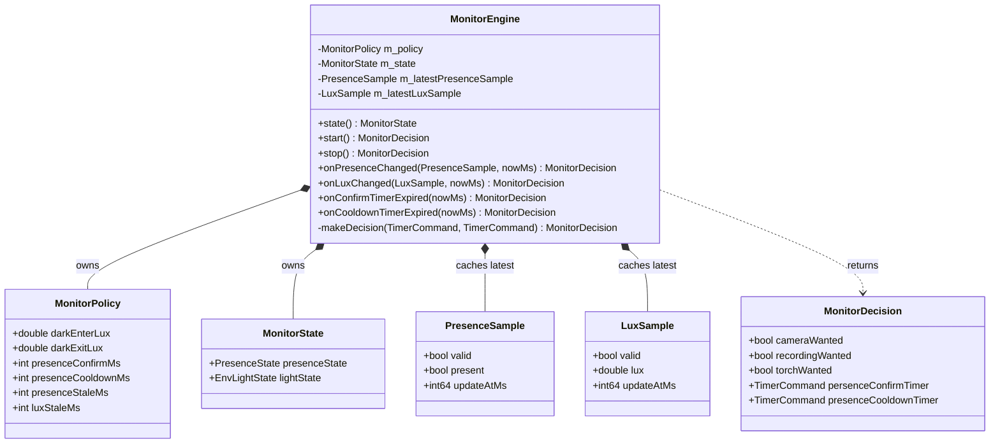

# System class diagram

## 当前实现范围

- `app.pro` 构建的 `app_entrance` 当前实现了一条 AP3216C 模拟采样链路：`Ap3216cPage -> Ap3216cController -> SensorService -> SensorWorker`。
- `main/main.cpp` 是当前的 composition root，不是业务类。它负责创建对象、注册跨线程值类型、建立 signal/slot 连接、把 Worker 移入 I/O 线程，以及启动和停止线程。
- `application/smart_monitor/MonitorEngine` 是独立的纯 C++ 业务状态机，目前仅由 `monitor_engine_test` 使用，尚未接入上述 Qt GUI 和传感器链路。

## 类和数据类型职责

- `Ap3216cPage`（表示层，GUI 线程）
  - 创建状态标签、采样值标签以及开始、停止按钮，并通过布局管理控件。
  - 将 `QPushButton::clicked` 转换为不携带界面细节的用户意图 signal：`startRequested()` 和 `stopRequested()`。
  - `renderViewState()` 根据完整的 `Ap3216cViewState` 更新文本和按钮可用状态。
  - 不创建 Controller，不访问 Service、Worker 或设备接口。
- `Ap3216cController`（页面控制层，GUI 线程）
  - 接收 Page 的开始、停止意图，同步调用 `SensorService` 的命令接口。
  - 根据命令受理结果和 Service 的异步事件维护 `m_viewState`，再发射 `viewStateChanged()` 驱动页面整体渲染。
  - 持有非拥有型 `SensorService *`；Service 并非 Controller 的内嵌对象，其生命周期由 composition root 保证。
  - 不执行传感器 I/O，也不直接访问 Worker。
- `SensorService`（设备服务门面，GUI 线程）
  - 对 Controller 提供同步命令接口 `requestStartSampling()` 和 `requestStopSampling()`；返回值只表示命令是否被受理。
  - 维护服务侧 `SamplingState`，拦截重复开始或重复停止请求。
  - 通过 `workerStartRequested()`、`workerStopRequested()` 将命令异步投递给 Worker。
  - 接收 Worker 的最终状态和采样结果，校验当前状态后以 `samplingStarted()`、`sampleUpdated()`、`samplingStopped()` 对上层重新发布。
  - 不执行设备 I/O，也不拥有或直接调用 Worker。
- `SensorWorker`（设备执行层，Sensor I/O 线程）
  - 在自己的线程中创建并管理 `QTimer`，当前每 500 ms 执行一次模拟采样。
  - `startSampling()`、`stopSampling()` 是跨线程命令入口，必须通过 queued connection 调用。
  - `sampleOnce()` 生成 `FakeSample`；当前每第 5 次采样模拟一次传感器错误。
  - 通过 signal 按值返回启停完成事件和采样结果，不访问 GUI 对象。
- `Ap3216cViewState`（页面渲染值类型）
  - 保存 `samplingState`、`hasSample`、最近一次 `sample` 和展示文本 `status`。
  - 由 Controller 组装，由 Page 只读消费；`hasSample` 用于区分“尚未采样”和“已经收到无效采样”。
- `FakeSample`（跨线程采样值类型）
  - 保存有效标志、模拟值、更新时间戳和错误文本，不持有 QObject、设备句柄或外部缓冲区。
  - 通过 `Q_DECLARE_METATYPE` 声明，并在 composition root 中调用 `qRegisterMetaType` 注册，以支持 queued connection 按值传递。
- `OperationResult`（同步命令受理结果）
  - `code` 表示 `Accepted`、`Busy` 等结果，`error` 提供失败原因。
  - `Accepted` 只代表 Service 已受理命令，不代表 Worker 已经完成启停。
- `SamplingState`（采样生命周期枚举）
  - 取值为 `Idle`、`Starting`、`Running`、`Stopping`，由 Service 和页面 ViewState 分别保存各自状态。
- `MonitorEngine`（独立业务决策状态机，当前未接入主程序）
  - 根据人体存在样本、环境光样本、确认/冷却定时器事件和 `MonitorPolicy` 更新 `MonitorState`。
  - 返回 `MonitorDecision`，描述摄像头、录像、补光灯和定时器的期望状态。
  - 不继承 `QObject`，没有 signal/slot，也不依赖 GUI、线程或设备层。

## Signal/slot 关联

- 页面内部（GUI 线程，默认 direct 调用）：
  - `QPushButton::clicked` -> `Ap3216cPage::startRequested`
  - `QPushButton::clicked` -> `Ap3216cPage::stopRequested`
- Page 与 Controller（GUI 线程，默认 direct 调用）：
  - `Ap3216cPage::startRequested` -> `Ap3216cController::requestStart`
  - `Ap3216cPage::stopRequested` -> `Ap3216cController::requestStop`
  - `Ap3216cController::viewStateChanged(Ap3216cViewState)` -> `Ap3216cPage::renderViewState(Ap3216cViewState)`
- Controller 与 Service（GUI 线程）：
  - Controller 直接调用 `SensorService::requestStartSampling()` / `requestStopSampling()`，立即取得 `OperationResult`。
  - `SensorService::samplingStarted` -> `Ap3216cController::handleSamplingStarted`
  - `SensorService::sampleUpdated(FakeSample)` -> `Ap3216cController::handleSampleUpdated(FakeSample)`
  - `SensorService::samplingStopped` -> `Ap3216cController::handleSamplingStopped`
- Service 与 Worker（跨 GUI/I/O 线程，显式 `Qt::QueuedConnection`）：
  - `SensorService::workerStartRequested` -> `SensorWorker::startSampling`
  - `SensorService::workerStopRequested` -> `SensorWorker::stopSampling`
  - `SensorWorker::samplingStarted` -> `SensorService::handleWorkerStarted`
  - `SensorWorker::sampleProduced(FakeSample)` -> `SensorService::handleWorkerSample(FakeSample)`
  - `SensorWorker::samplingStopped` -> `SensorService::handleWorkerStopped`
- Worker 内部与生命周期：
  - `QTimer::timeout` -> `SensorWorker::sampleOnce`，两者均位于 Sensor I/O 线程。
  - `QThread::finished` -> `SensorWorker::deleteLater`，在线程结束阶段释放无 parent 的 Worker。

## 类图

图中的实线箭头表示同步调用或数据使用，虚线箭头表示 signal/slot 事件流；`queued` 标记表示跨线程排队调用。



一次完整的开始和采样回传路径为：

```text
按钮点击
  -> Page 发出 startRequested
  -> Controller::requestStart
  -> Service::requestStartSampling（同步受理）
  -> Service 发出 workerStartRequested
  -> [queued] Worker::startSampling
  -> Worker 发出 samplingStarted
  -> [queued] Service::handleWorkerStarted
  -> Service 发出 samplingStarted
  -> Controller::handleSamplingStarted
  -> Controller 发出 viewStateChanged
  -> Page::renderViewState

QTimer::timeout
  -> Worker::sampleOnce
  -> Worker 发出 sampleProduced(FakeSample)
  -> [queued] Service::handleWorkerSample
  -> Service 发出 sampleUpdated(FakeSample)
  -> Controller::handleSampleUpdated
  -> Controller 发出 viewStateChanged(Ap3216cViewState)
  -> Page::renderViewState
```

## 尚未接入主程序的业务状态机

`MonitorEngine` 与相关值类型当前形成独立模型。下图只表示纯 C++ 组合和数据依赖，不表示已有 signal/slot 连接。


