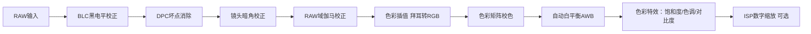

# OV5640数据手册摘要

先了解 OV5640的基本工作原理，后续参考数据手册逐步看各个 functions，就不难理解了。

## 总览——OV5640数据流

OV5640 diagram 可以参考 figure 2-1

主要包含：

### 阶段1：感光阵列+时序发生器

#### 完整工作流程

1. 入射光线照射像素，光电二极管将光强转换为模拟电荷，电荷存储在像素电容内；OV5640拥有2624x1964像素的图像阵列，但只有2592x1944为有效可输出像素，其余用于黑电平校准和插值。（ref 3.1）
2. 时序发生器读取寄存器配置，3 种像素读取规则可单独 / 组合开启：
    - **Cropping 阵列开窗裁剪**：配置 `0x3800~0x3807` 像素行列起止地址，仅读取阵列中间指定区域，直接丢弃边缘像素电荷；
    - **Binning 像素合并**：寄存器 `0x3821[0]` 使能，同色相邻 4 个像素电荷硬件相加平均，模拟域完成像素融合；提升低光感光度、降低噪声，分辨率直接减半；支持2x2、1x2、2x1
    - **硬件 Subsampling 行列下采样**：寄存器配置行列步长，读取时直接跳过整行 / 整列像素，不合并电荷，单纯削减输出像素数量；
3. 经过裁剪 / Binning / 下采样筛选后的像素电荷，统一输出至 ADC 模块。

注：一般配置2x2 Binning + 水平 + 垂直硬件下采样；Binning 2x1横向合并配合隔列下采样，或者 Binning 1x2纵向合并配合隔行下采样也可，但画面比例稍显奇怪。

#### 两种典型场景（对应 Table2.1 分辨率表）

- **场景 A：5M 2592×1944 15fps 原图输出**
    时序配置：关闭裁剪、关闭 Binning、无行列跳读，完整读取全部 2592×1944 像素电荷；ADC 输入数据量最大，时钟 96/192MHz，帧率最低。
- **场景 B：720P 1280×720 60fps 高帧率**
    时序配置：先裁剪阵列去除上下冗余区域，开启 2x2 Binning，同时开启行列隔行下采样；模拟端直接把像素总量压缩，大幅降低 ADC 带宽，实现高帧率输出。

#### 核心特点

所有缩放 / 裁剪操作**发生在模拟电荷阶段，数字化之前**，能从源头降低芯片功耗、像素时钟频率，是 OV5640 高帧率（VGA90fps/QVGA120fps）的核心实现手段。

### 阶段2：ADC

#### 功能定位

连接模拟前端与数字 ISP 的转换桥梁，单通道 10 位模数转换器。

- **外部 XVCLK：低速参考时钟**（24MHz 常用），仅做基准；
- **PLL 模块**：倍频 / 分频生成整套系统时钟树，输出多路同步时钟；
- **ADC 采样时钟**：PLL 输出的高速同步时钟，决定 ADC 转换速度、像素读出速率。
	- OV5640 是列并行 10bit 逐次逼近 ADC，每一列像素对应一路 ADC，所有 ADC 必须完全同步采样 / 保持 / 量化，否则画面出现横纹、摩尔纹、色偏。
	- PLL 输出单一同源高频时钟，保证所有 ADC、行 / 列读出电路相位完全对齐；外部离散时钟无法做到全局同步
	- PLL 倍频/多级分频能够调整 ADC 采样时钟频率，适配不同带宽需求

#### 工作流程

1. 时序发生器输出的像素模拟电压（电荷转换而来）送入 ADC 输入端口；
2. ADC 将连续模拟电压采样量化，输出**10bit 拜耳 RAW 数字数据**；
	1. 数据格式：BGGR 拜耳阵列，每个像素仅包含单通道色彩信息（蓝 / 绿 / 红）；
3. 10bit RAW 数据流送入后级 ISP 处理器，进入全数字图像处理链路。

#### 关键参数

- 量化精度：10bit，动态范围最高 68dB（8x 增益条件下）；
	- 增益用来放大弱光信号电压，使其填满 ADC 量程；
	- 增益分模拟增益（ADC 前，优先推荐）+ 数字增益（ADC 后 ISP 内，同步放大噪声，不提升动态范围）；
	- OV5640 AEC 逻辑：优先拉长曝光，曝光拉满后再开模拟增益，增益拉满才启用数字增益。
- 时钟来源：PLL 生成内部像素时钟，输入晶振范围 6~27MHz；
- 无图像算法，仅做模拟→数字信号转换。

### 阶段3：ISP 图像处理器

注意这里是流水线处理过程，如 CIP 后才能完整后续 CMX、AWB 等工作。CIP 前也要先 DPC 等，不然插值过程中坏点扩散。

- **BLC 黑电平校正（0x40xx 寄存器）**：利用阵列四周无光黑像素采集基底噪声，统一扣除整张画面的暗电流偏移，消除暗光下灰雾。
- **DPC 坏点消除（0x5000 [1] 使能）**：检测亮点 / 暗缺陷像素，使用周边正常像素插值替换，修复工艺缺陷带来的噪点。
- **LENC 镜头暗角校正（0x5000 [7] 使能）**：补偿镜头边缘进光量不足问题，对画面四角像素自动提升增益，消除四角发暗。
- **RAW Gamma 伽马校正（0x5000 [5] 使能）**：适配人眼非线性感光特性，提亮暗部、压缩高光，提升动态观感。
- **C 色彩插值 CIP（0x5000 [0] 使能）**：拜耳单通道 RAW 还原完整 RGB 三通道像素，相邻像素插值补齐缺失色彩，输出全彩图像。（后续处理需要 RGB 三通道像素）
- **CMX 色彩矩阵**：校正传感器原生色彩偏色，调整红绿蓝通道增益，还原真实物体色彩。
- **AWB 自动白平衡（0x5001 [0] 使能）**：自动识别环境色温，调整 R/B 通道增益，保证白色物体不偏黄 / 偏蓝；支持自动 / 手动模式。
- **SDE 数字特效**：统一控制饱和度、色相、亮度、对比度，支持黑白、复古、反色等滤镜效果。
- **ISP 数字缩放 Scaling（0x5001 [5] 使能）**：
	- **第二套独立缩放机制，数字域操作**
    - 前提：前端时序已经完整读出一整幅 RAW 图像，全部画质校正完成后再缩放；
    - 原理：多像素插值重采样，支持任意非整数缩小比例；
    - 和阶段 1Binning 区别：不丢弃原始像素信息，缩放后画质更好，但不会降低 ADC 带宽；
    - 典型搭配：前端输出 1280×960，ISP 缩放至 640 VGA/320 QVGA。

### 阶段4：Formatter 格式化单元

#### 核心功能

1. **图像格式转换（核心寄存器 0x4300）**：将 ISP 输出 RGB 数据转换成主控需要的输出格式，支持类型：RAW8/10、RGB565/RGB555/RGB444、YUV422/YUV420、CCIR656 标准格式。
2. **输出窗口二次裁剪**：寄存器 `0x3808~0x380B` 配置输出宽高，仅裁剪画面边缘像素，**无缩放、无插值**，仅裁掉不需要的边框，仅裁切最终输出画面，不影响前端带宽。
3. **硬件 JPEG 压缩引擎（可选集成）**：片内硬件编码器，无需主控 CPU 做压缩；提供 6 种压缩时序模式，可配置量化表、输出尺寸，压缩后数据直接送入 FIFO，大幅降低传输带宽。
4. 数据打包层：Formatter 将像素按 8/10bit 组拼成字节流；
5. 物理总线层（DVP/MIPI）：字节流转为并行同步信号 / MIPI 差分串行数据包。

**疑问**：ISP 中 RAW 经过 CIP 获得 RGB，如果 Formatter 中最后要求输出 RAW，中间岂不是徒劳？

寄存器 `0x501F` 格式选择器可切换两路数据流：

1. 正常视频流：RAW → 完整 ISP（含 CIP 插值）→ RGB/YUV → Formatter 输出
2. RAW 旁路流：ADC RAW 数据**直接绕过 CIP、CMX、AWB 等所有色彩模块**，直通 Formatter 输出不存在 “先转 RGB 再还原 Bayer” 的反向运算，硬件有独立旁路通道，直接输出原始未插值 Bayer 数据。

### 阶段5：FIFO 缓存 + DVP/MIPI 物理输出接口

#### 1. FIFO 帧缓存

片内同步 FIFO 存储器，缓存 Formatter 输出的完整图像数据，解决 ISP 图像处理速度与主控读取速度不匹配的问题，防止数据丢失、画面撕裂。

#### 2. 双输出硬件接口（二选一，寄存器 0x300E 切换）

##### DVP 10bit 并行接口

引脚 D0~D9、PCLK、VSYNC、HREF 并行同步输出，8/10bit 可选，适合单片机、FPGA 短距离摄像方案。

时序：VSYNC 帧同步、HREF 行有效、PCLK 像素时钟同步传输像素。

##### 双通道 MIPI CSI-2 串行接口

MCP/MCN（时钟 lane）、MDP0/MDN0、MDP1/MDN1（两路数据 lane）高速差分串行输出，抗干扰强，适配手机、平板等嵌入式设备。支持高速 HS 传输与低速 LP 控制模式。

#### 输出终点

图像数据通过 DVP/MIPI 传输到外部 MCU/FPGA，由主控进行存储、显示、图像识别等上层业务。

## DVP 时钟

### 基础概念

- XVCLK：外部输入基准时钟，作为 PLL 参考源，正点原理 ATK-MC5640模块为24MHz
- PCLK：DVP 像素同步时钟
- DVP 10bit/8bit：10bit 模式 D0~D9全部启用；8bit 模式 D8 & D9 悬空
- PLL：内部时序、ADC、DVP/MIPI 时钟均由 PLL 生成，寄存器`0x3034/0x3035/0x3036/0x3037`为 PLL 核心配置寄存器。

### PLL 时钟计算公式

$$
P C L K = \frac {X V C L K \times M u l t i}{P r e D i v \times S y s D i v \times B i t D i v}
$$

参数寄存器对照表：

| 参数            | 寄存器      | Bit 位  | 说明                                            |
| ------------- | -------- | ------ | --------------------------------------------- |
| $Multi$ 倍频系数  | `0x3036` | Bit7~0 | 4~127 任意整数；128~252 仅偶数                        |
| $PreDiv$ 前置分频 | `0x3037` | Bit3~0 | 1/2/3/4/6/8；Bit4=1 时额外二分频                     |
| $SysDiv$ 系统分频 | `0x3035` | Bit7~4 | DVP 模式：分频系数 = N；MIPI 为 N/2                    |
| $BitDiv$ 位分频  | `0x3034` | Bit3~0 | 0x08 = 二分频 (8bit DVP)；0x0A=2.5 分频 (10bit DVP) |

- $PreDiv$ 预分频，外部 XVCLK 输入后第一个电路单元，一般用来先压低输入时钟，保证配合 $Multi$ 倍频后频率在 OV5640内部 VCO 工作区间 500MHz~1000MHz
- $SysDiv$ 为全局分频，降低 ADC、ISP、DVP/MIPI 时钟频率，数据手册2.3中不同格式要求的 PCLK 就可通过此调整
- $BitDiv$ 仅 DVP/MIPI 输出端口单独分频，只改变像素输出时钟

## CLK/windowing 如何配置——以 1080p@30fps 为例

每帧像素量由下决定：

$TotalTP = HTS × VTS$

- $HTS$: 水平总像素（寄存器 `0x380C/0x380D`）= 有效输出宽度 + 水平消隐哑像素
- $VTS$: 垂直总行数（寄存器 `0x380E/0x380F`）= 有效输出高度 + 垂直消隐哑行

像素时钟频率与帧率、分辨率关系如下：

$$
PCLK = FPS \times HTS \times VTS
$$

需要注意的是，该公式中限制的瓶颈为 ADC。因此，只有模拟前端 Cropping/Binning/Subsampling 能减少一帧总像素周期，降低带宽、拉高帧率；ISP 缩放不减少 ADC 读取像素量，带宽不变，帧率不变。

因此，对于 1080p@30fps ，应该有如下配置：

- 模拟前端 cropping，居中裁剪1920x1080
- 关闭 Binning、硬件 Subsampling
- $PCLK=30fps \times 1920 \times 1080 \approx 63MHz$
- 关闭 ISP Scaling
- Formatter 后输出1920x1080

**但手册写的是96MHz，为什么？**

因为 PLL 在24MHz 输入下能稳定输出的标准整数 PCLK 为24/48/96/192MHz，实际会设置较大 PCLK，通过消隐控制大小和帧率。

首先澄清消隐 (Blanking) 和哑像素 (Dummy) 概念差异

| 对象          | 位置                      | 本质            | 能否输出                        | 控制寄存器                                 |
| ----------- | ----------------------- | ------------- | --------------------------- | ------------------------------------- |
| 光学黑像素 OB    | 手册3.1中提及的32x20大小的边缘区域   | 芯片物理阵列四周，金属遮光 | BLC 参考源，无论 cropping 会送入 ISP |                                       |
| 哑像素 Dummy   | ISP Input 画面内部左右 / 上下边缘 | 物理阵列真实遮光像素    | 会送入 ISP，输出前裁掉               | 0x3800~0x3807 开窗坐标                    |
| 消隐 Blanking | HREF/VSync 无效区，画面之外     | 时序空白周期，无像素读出  | 无任何像素数据                     | 0x380C~0x380D(HTS)、0x380E~0x380F(VTS) |

- VTS/HTS 中包含消隐值（Input 高/宽+垂直/水平消隐）：水平最小252，垂直最小144
	- 调节分辨率及帧率（相同 PCLK 下填充消隐值）
	- 流水线时序缓冲
	- 频闪检测采样窗口
	- VCM 对焦、AE 测光辅助采样区
	- PCLK 同步容错
- DVP timing (figure6-7, table6-7)
	- tp：一个 PCLK 像素时钟周期，作为时序长度单位
	- DVP 四线同步信号：
		- VSYNC：帧同步
		- HREF：行有效（高）
		- HSYNC：行消隐同步脉冲
		- D[9:0]：并行数据线

可参考 figure6-7, table6-7图像阅读，各个区域含义如下：

1. 整帧总周期
2. VSYNC 脉冲宽度
3. 帧前垂直消隐
4. 单行总周期
5. 帧后垂直消隐
6. 单行有效数据宽度
7. 单行水平消隐
8. HSYNC 行同步脉冲时延
9. HSYNC 行同步脉冲宽度

> [!question]
> - HREF 似乎足以表明行消隐，为什么还需要 HSYNC？

- **HREF（Data Enable，行有效使能）**：电平信号，**一段连续高低**；高电平 = 当前 PCLK 下 D [9:0] 像素数据有效；仅区分「一行有没有像素」。
- **HSYNC（Horizontal Sync，行同步脉冲）**：窄脉冲信号，**单点跳变沿**；每一行消隐区间输出固定宽度脉冲，专门标记**单行起始边界**。
- 核心好处为保证精准捕捉到每行第一个有效像素（即便 FPGA/MCU 采样时钟异步）
	- 兼容 CCIR656、VGA 等标准
	- OV5640中 JPEG 编码器也要求以此作为每行起始标记
	- ISP 中50/60Hz 频闪、AEC 测量以此分辨测光窗口
